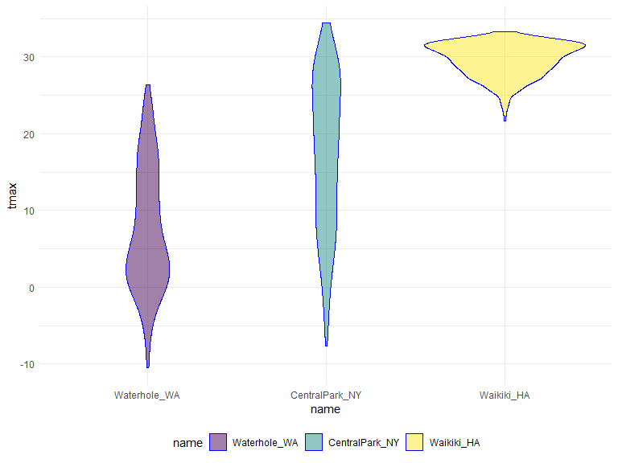
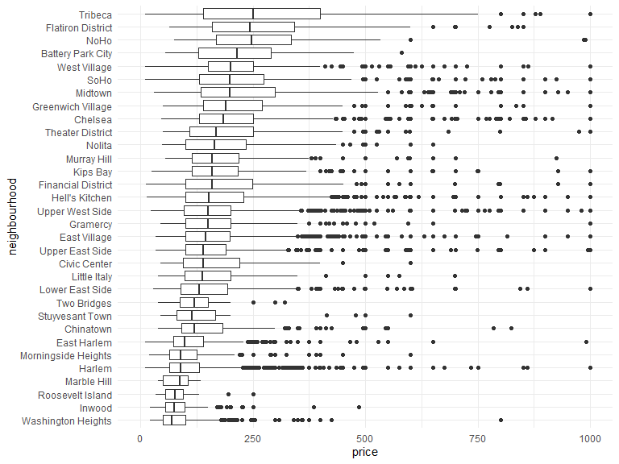
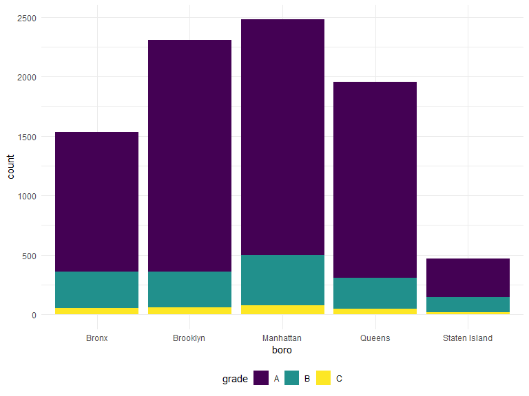

Data Wrangling II: Strings and Factors
================
Kristal Quispe
10/19/2019

read.csv will assign charecter variables to be factors. read\_csv will
not make it a factor until you tell it to.

## String manipulation

``` r
string_vec = c("my", "name", "is", "jeff")
#string vector that has four things in it
str_detect(string_vec, "jeff")
```

    ## [1] FALSE FALSE FALSE  TRUE

``` r
#every fucntion in the stringer package start with str_. The str_dectet tries to detect a pattern in string variable. Str_detet is saying in my string (string_vec), find or tell me where and if the string "Jeff" exisits. 
```

``` r
str_replace(string_vec, "m", "M")
```

    ## [1] "My"   "naMe" "is"   "jeff"

``` r
#replace any observation with m(lc), with M (uc)
```

``` r
string_vec = c(
  "i think we all rule for participating",
  "i think i have been caught",
  "i think this will be quite fun actually",
  "it will be fun, i think"
  )
str_detect(string_vec, "i think$")
```

    ## [1] FALSE FALSE FALSE  TRUE

``` r
#i think with a $, "i think$", means which of these string ends with I think. "^i think" means which string starts with I think. 
```

``` r
string_vec = c(
  "Y'all remember Pres. HW Bush?",
  "I saw a green bush",
  "BBQ and Bushwalking at Molonglo Gorge",
  "BUSH -- LIVE IN CONCERT!!"
  )
str_detect(string_vec, "[Bb]ush")
```

    ## [1]  TRUE  TRUE  TRUE FALSE

``` r
#"[Bb]ush", is asking if the string has bush, with a capital B or lower case b, but "ush" has to be lower case.
```

``` r
string_vec = c(
  '7th inning stretch',
  '1St half soon to begin. Texas won the toss.',
  'she is 5 feet 4 inches tall',
  '3AM - cant sleep :('
  )
str_detect(string_vec, "[0-9][a-zA-Z]")
```

    ## [1]  TRUE  TRUE FALSE  TRUE

``` r
#here you are detecting any pattern with any number from 0 to 9, followed by any two letters, lower case a-z, upper case A to upper case Z, or a combo of both. 
```

``` r
string_vec = c(
  'Its 7:11 in the evening',
  'want to go to 7-11?',
  'my flight is AA711',
  'NetBios: scanning ip 203.167.114.66'
  )
str_detect(string_vec, "7.11")
```

    ## [1]  TRUE  TRUE FALSE  TRUE

``` r
#this string is trying to detect any 7, followed by any charcter, then 11. (any charecter is ".")
```

``` r
string_vec = c(
  'The CI is [2, 5]',
  ':-]',
  ':-[',
  'I found the answer on pages [6-7]'
  )
str_detect(string_vec, pattern = "\\[")
```

    ## [1]  TRUE FALSE  TRUE  TRUE

``` r
#this string detect is trying to find an open square bracket. To sppecify that you are looking for teh chareceter "[" and not the begining of a range for a regular expression. Use a back slash to indicate the bracket is a charecter, and use another back slash to indicate that the back slash you just used is for a charecter backslash and not a speacial chareceter. "Search for actual bracket that is a charecter"
```

## use strings in practice

PULSE

``` r
pulse_data = 
  haven::read_sas("./data/public_pulse_data.sas7bdat") %>%
  janitor::clean_names() %>%
  pivot_longer(
    bdi_score_bl:bdi_score_12m,
    names_to = "visit", 
    names_prefix = "bdi_score_",
    values_to = "bdi") %>%
  select(id, visit, everything()) %>%
  mutate(
    visit = str_replace(visit, "bl", "00m"),
    visit = fct_relevel(visit, str_c(c("00", "01", "06", "12"), "m"))) %>%
  arrange(id, visit)
```

``` r
nsduh_url = "http://samhda.s3-us-gov-west-1.amazonaws.com/s3fs-public/field-uploads/2k15StateFiles/NSDUHsaeShortTermCHG2015.htm"
table_marj = 
  read_html(nsduh_url) %>% 
  html_nodes(css = "table") %>% 
  .[[1]] %>%
  html_table() %>%
  slice(-1) %>%
  as_tibble()
```

``` r
table_marj %>% 
  select(-contains("P Value")) %>% 
  pivot_longer(
    -State,
    names_to = "age_year",
    values_to = "percent"
  ) %>% 
  separate(age_year, into = c("age", "year"), sep = "\\(") %>% #this seperares age and year by an open perentecy
  mutate(
    year = str_replace(year, "\\)", ""), # detect a close perentacy and replace with nothing. 
    percent = str_replace(percent, "[a-c]$", ""), # detect a charecter of a-c, which is at the end of the string only, and replace with nothing. 
    percent = as.numeric(percent) #make perecnt numeric, before it was charecter because it included a number before
  )
```

    ## # A tibble: 560 x 4
    ##    State      age   year      percent
    ##    <chr>      <chr> <chr>       <dbl>
    ##  1 Total U.S. 12+   2013-2014   12.9 
    ##  2 Total U.S. 12+   2014-2015   13.4 
    ##  3 Total U.S. 12-17 2013-2014   13.3 
    ##  4 Total U.S. 12-17 2014-2015   12.9 
    ##  5 Total U.S. 18-25 2013-2014   31.8 
    ##  6 Total U.S. 18-25 2014-2015   32.1 
    ##  7 Total U.S. 26+   2013-2014    9.63
    ##  8 Total U.S. 26+   2014-2015   10.2 
    ##  9 Total U.S. 18+   2013-2014   12.9 
    ## 10 Total U.S. 18+   2014-2015   13.4 
    ## # ... with 550 more rows

## Factors

``` r
weather_df = 
  rnoaa::meteo_pull_monitors(
    c("USW00094728", "USC00519397", "USS0023B17S"),
    var = c("PRCP", "TMIN", "TMAX"), 
    date_min = "2017-01-01",
    date_max = "2017-12-31") %>%
  mutate(
    name = recode(id, USW00094728 = "CentralPark_NY", 
                      USC00519397 = "Waikiki_HA",
                      USS0023B17S = "Waterhole_WA"),
    tmin = tmin / 10,
    tmax = tmax / 10) %>%
  select(name, id, everything())
```

    ## Registered S3 method overwritten by 'crul':
    ##   method                 from
    ##   as.character.form_file httr

    ## Registered S3 method overwritten by 'hoardr':
    ##   method           from
    ##   print.cache_info httr

    ## file path:          C:\Users\kriqu\AppData\Local\rnoaa\rnoaa\Cache/ghcnd/USW00094728.dly

    ## file last updated:  2019-10-02 16:18:47

    ## file min/max dates: 1869-01-01 / 2019-09-30

    ## file path:          C:\Users\kriqu\AppData\Local\rnoaa\rnoaa\Cache/ghcnd/USC00519397.dly

    ## file last updated:  2019-10-02 16:19:05

    ## file min/max dates: 1965-01-01 / 2019-09-30

    ## file path:          C:\Users\kriqu\AppData\Local\rnoaa\rnoaa\Cache/ghcnd/USS0023B17S.dly

    ## file last updated:  2019-10-02 16:19:13

    ## file min/max dates: 1999-09-01 / 2019-09-30

``` r
weather_df %>%
  mutate(name = fct_relevel(name, c("Waterhole_WA"))) %>% 
  #the relevel here moved water hole to the first place and then left the implicit albhabetical ordering to order the rest of the graphs
  ggplot(aes(x = name, y = tmax)) + 
  geom_violin(aes(fill = name), color = "blue", alpha = .5) + 
  theme(legend.position = "bottom")
```



``` r
weather_df %>%
  mutate(name = fct_reorder(name, tmax)) %>% 
  #instead of relevel, use reorder to relevel one factor variable according to the values of this other variable on top of it. We are reordering name, based on tmax, the name associated the smalled median t max will be level 1, and the name with the next smallest median t max will be level 2. 
  ggplot(aes(x = name, y = tmax)) + 
  geom_violin(aes(fill = name), color = "blue", alpha = .5) + 
  theme(legend.position = "bottom")
```


``` r
data("nyc_airbnb")
nyc_airbnb %>%
  filter(neighbourhood_group == "Manhattan") %>% 
  mutate(
    neighbourhood = fct_reorder(neighbourhood, price, na.rm = TRUE)) %>% # here we are ordering neighboorhood, based on price, and sometime prices are missing so remove those missing values
  ggplot(aes(x = neighbourhood, y = price)) +
  geom_boxplot() +
  coord_flip() + # this flips x and y axis
  ylim(0, 1000) # this limits th y axis to 10000
```



what about factors and linear models …?

``` r
weather_df %>%
  lm(tmax ~ name, data = .)
```

    ## 
    ## Call:
    ## lm(formula = tmax ~ name, data = .)
    ## 
    ## Coefficients:
    ##      (Intercept)    nameWaikiki_HA  nameWaterhole_WA  
    ##           17.366            12.291            -9.884

``` r
#name vairbles here is the categorical predictor
```

``` r
weather_df %>%
  mutate(name = forcats::fct_relevel(name, c("Waikiki_HA", "CentralPark_NY", "Waterhole_WA"))) %>% 
  lm(tmax ~ name, data = .)
```

    ## 
    ## Call:
    ## lm(formula = tmax ~ name, data = .)
    ## 
    ## Coefficients:
    ##        (Intercept)  nameCentralPark_NY    nameWaterhole_WA  
    ##              29.66              -12.29              -22.18

\#If you want to change the referece gourp you can use relevel to do so.

``` r
data("rest_inspec")

rest_inspec %>% 
  group_by(boro, grade) %>% 
  summarize(n = n()) %>% 
  spread(key = grade, value = n)
```

    ## # A tibble: 6 x 8
    ## # Groups:   boro [6]
    ##   boro              A     B     C `Not Yet Graded`     P     Z `<NA>`
    ##   <chr>         <int> <int> <int>            <int> <int> <int>  <int>
    ## 1 BRONX         13688  2801   701              200   163   351  16833
    ## 2 BROOKLYN      37449  6651  1684              702   416   977  51930
    ## 3 MANHATTAN     61608 10532  2689              765   508  1237  80615
    ## 4 Missing           4    NA    NA               NA    NA    NA     13
    ## 5 QUEENS        35952  6492  1593              604   331   913  45816
    ## 6 STATEN ISLAND  5215   933   207               85    47   149   6730

``` r
rest_inspec =
  rest_inspec %>%
  filter(grade %in% c("A", "B", "C"), boro != "Missing") %>% 
  mutate(boro = str_to_title(boro)) #this (str_to_title)makes the first charecter capitalized and the other ones not. 
```

``` r
rest_inspec %>% 
  filter(str_detect(dba, "Pizza")) %>% #this code looks for pizza in the title
  group_by(boro, grade) %>% 
  summarize(n = n()) %>% 
  spread(key = grade, value = n)
```

    ## # A tibble: 5 x 3
    ## # Groups:   boro [5]
    ##   boro              A     B
    ##   <chr>         <int> <int>
    ## 1 Bronx             9     3
    ## 2 Brooklyn          6    NA
    ## 3 Manhattan        26     8
    ## 4 Queens           17    NA
    ## 5 Staten Island     5    NA

``` r
rest_inspec %>% 
  filter(str_detect(dba, "[Pp][Ii][Zz][Zz][Aa]")) %>% #this code looks for pizza in the title, but with diff combos of upper and lower case
  group_by(boro, grade) %>% 
  summarize(n = n()) %>% 
  spread(key = grade, value = n)
```

    ## # A tibble: 5 x 4
    ## # Groups:   boro [5]
    ##   boro              A     B     C
    ##   <chr>         <int> <int> <int>
    ## 1 Bronx          1170   305    56
    ## 2 Brooklyn       1948   296    61
    ## 3 Manhattan      1983   420    76
    ## 4 Queens         1647   259    48
    ## 5 Staten Island   323   127    21

``` r
rest_inspec %>% 
  filter(str_detect(dba, "[Pp][Ii][Zz][Zz][Aa]")) %>%
  ggplot(aes(x = boro, fill = grade)) + 
  geom_bar() 
```



``` r
rest_inspec %>% 
  filter(str_detect(dba, "[Pp][Ii][Zz][Zz][Aa]")) %>%
  mutate(boro = fct_infreq(boro)) %>% #fct in frequency, this code says which of these category labels is most common and which is the least common. The ggplot will reorder the plots from most to least
  ggplot(aes(x = boro, fill = grade)) + 
  geom_bar() 
```


rest\_inspec %\>% filter(str\_detect(dba, regex(“pizza”, ignore\_case =
TRUE))) %\>% mutate( boro = fct\_infreq(boro), boro = fct\_recode(boro,
“HipsterHQ” = “Brooklyn”)) %\>% ggplot(aes(x = boro, fill = grade)) +
geom\_bar() + scale\_fill\_viridis(discrete = TRUE) \#if you need to
change the labeling, but preserve factors, use fct\_recode.
